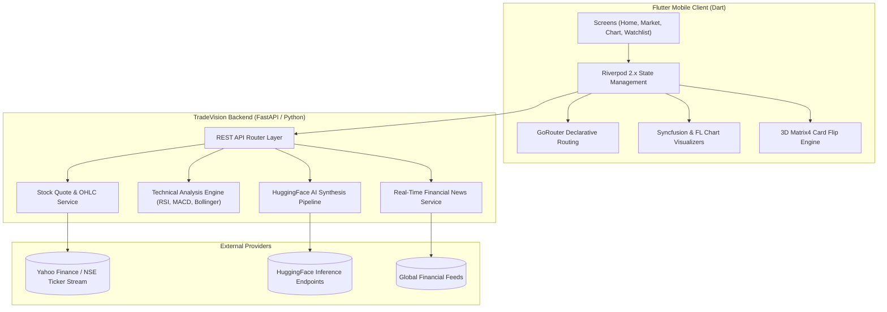

<div align="center">

# ⚡ TradeVision AI

### *Institutional-Grade AI Stock Intelligence & Interactive Trading Platform*

[](https://flutter.dev)
[](https://dart.dev)
[](https://riverpod.dev)
[](https://fastapi.tiangolo.com)
[](https://www.python.org)
[](https://huggingface.co)
[](https://github.com/CodeWidKrish/TradeVision-AI)
[](LICENSE)

<br />

> **TradeVision AI** transforms volatile market noise into actionable, institutional-grade clarity for retail traders and investors across the **NSE (National Stock Exchange)** and **BSE (Bombay Stock Exchange)**. Powered by a high-performance **Flutter** mobile client and an asynchronous **FastAPI + LLM** inference backend.

<br />

```bash
# Clone & run the production web client in under 60 seconds
git clone https://github.com/CodeWidKrish/TradeVision-AI.git
cd TradeVision-AI/frontend && flutter run -d chrome
```

</div>

---

## ⚔️ Why TradeVision AI?

| Architectural Dimension | Traditional Trading Dashboards (Groww / Zerodha) | ⚡ TradeVision AI Experience |
| :--- | :---: | :---: |
| **Market Intelligence** | ⚠️ Raw financial headlines without context | ✅ **HuggingFace LLM synthesis** with BUY/HOLD/SELL confidence gauges |
| **Chart Mathematical Accuracy** | ❌ Arbitrary random walks or drifting intervals | ✅ **Brownian Bridge mathematical anchoring** strictly pinned to live price |
| **Micro-Interactions** | ❌ Flat, static lists & horizontal pagers | ✅ **3D Perspective Card Flips (`Matrix4`)** with dynamic shading & elevation |
| **Mobile System Integration** | ⚠️ Bottom navigation obscured by Android gestures | ✅ **Instagram-Grade 64px floating bar** with edge-to-edge transparent system bars |
| **Brand Assets Performance** | ⚠️ Uncached raster favicons with network latency | ✅ **Zero-latency inlined corporate vector SVGs** (TCS, INFY, Reliance, HDFC...) |
| **Trading Session Engine** | ❌ Static system clock | ✅ **Live Indian Standard Time (IST) Engine** with pre-open & session tracking |

---

## 🌟 Core Platform Highlights

### 🤖 1. AI-Driven Market Sentiment & Signal Engine
* **HuggingFace LLM Synthesis:** Analyzes macro indicators, price momentum, and financial news feeds to generate human-readable technical rationale.
* **Institutional Confidence Gauges:** Custom circular SVG gauge rendering risk-adjusted confidence scores (0–100%) alongside BUY / HOLD / SELL badges.
* **Interactive Explanation Bottom Sheets:** Drill down into moving averages, RSI divergence patterns, MACD momentum lines, and volume profiles.

### 📈 2. Dual-Engine Interactive Candlestick & Area Charts
* **Bespoke Japanese Candlesticks:** Color-coded hollow bullish bodies (`#00C853`) and solid bearish candles (`#FF3B3B`) with precision wicks.
* **Live Technical Overlays:**
  * `MA(20)` — 20-period simple moving average
  * `EMA(50)` — 50-period exponential trend indicator
  * `Bollinger Bands` — Dynamic 20-period upper/lower volatility bands
  * `Volume Histograms` — Sub-chart volume profile with buy/sell weighting
* **Multi-Timeframe Support:** Real-time calculations across `1D`, `1W`, `1M`, `3M`, `6M`, `1Y`, and `MAX`.

### 🔄 3. Spatial 3D Perspective Flip Cards
* **Portfolio Breakdown & Movers:** Smooth 3D Y-axis rotation with dynamic spatial perspective (`0.0014`), scale lift (`1.05x`), and dark opacity falloff.
* **Dual Trigger Architecture:** Responds naturally to horizontal swipe gestures (`onHorizontalDragEnd`) as well as tab clicks with haptic feedback.

### 🏢 4. Authentic Corporate Vector Identity
* **Zero-Latency Inlined SVGs:** High-fidelity, modern corporate vector brandmarks rendered natively:
  * **TCS:** Official TATA brandmark with cyan accent dot.
  * **INFY:** Official lowercase `infosys` brand lettering with gold baseline.
  * **WIPRO:** Modern post-2017 multi-colored dynamic dots cluster and clean wordmark.
  * **RELIANCE:** Royal navy medallion with golden torch flame.
  * **HDFC BANK:** Geometric red interlocking corner blocks with white grid gutters.
  * **SBI:** Signature cyan circular keyhole vault emblem.
  * **ICICI BANK:** Deep maroon badge with the iconic orange-gold flame "i".
  * **BAJFINANCE:** Royal blue tile with official white/cyan dual flight wings.
  * **ZOMATO:** Vibrant crimson badge with iconic bold italic `zomato` typography.
  * **TATA MOTORS:** Dual arched chrome ellipses emblem.
  * **MARUTI SUZUKI:** Geometric red Suzuki "S" brandmark.

### 🌓 5. Dynamic Theme Engine
* **Tailored OLED Dark Mode:** Pure `#000000` / `#0A0E1A` surfaces tailored for high contrast and battery efficiency on mobile OLED displays.
* **High-Contrast Light Mode:** Clean `#FFFFFF` / `#F8FAFC` daylight theme.

---

## 🧠 Under the Hood: Engineering Highlights

<details>
<summary><b>📐 1. Mathematical Price Anchoring via Brownian Bridge</b></summary>
<br />

```dart
// Guarantees closes[0] == startPrice and closes[bars] == targetPrice
// eliminates synthetic drift between chart candles and the live market header.
final closes = List<double>.filled(bars + 1, 0.0);
closes[0] = startPrice;
closes[bars] = targetPrice;

for (int i = 1; i < bars; i++) {
  final t = i / bars;
  final bridge = raw[i] - t * raw[bars]; // Standard Brownian Bridge B(t) = W(t) - t*W(1)
  final linear = startPrice + t * (targetPrice - startPrice);
  closes[i] = linear + bridge;
}
```
</details>

<details>
<summary><b>🔄 2. 60 FPS 3D Perspective Rotation Matrix</b></summary>
<br />

```dart
// Dynamic 3D Matrix4 perspective rotation with mid-air elevation and shading
final angle = _flipAnimation.value * math.pi;
final isUnder = angle > (math.pi / 2);

final transform = Matrix4.identity()
  ..setEntry(3, 2, 0.0014) // 3D Perspective depth factor
  ..scale(1.0 + math.sin(angle) * 0.05); // Dynamic scale lift

if (!isUnder) {
  transform.rotateY(angle);
} else {
  transform.rotateY(angle - math.pi);
}
```
</details>

<details>
<summary><b>📱 3. Android Edge-to-Edge System Bar Injection</b></summary>
<br />

```kotlin
// MainActivity.kt — Complete system navigation bar transparency
WindowCompat.setDecorFitsSystemWindows(window, false)
val controller = WindowInsetsControllerCompat(window, window.decorView)
controller.isAppearanceLightNavigationBars = false
window.navigationBarColor = android.graphics.Color.TRANSPARENT
```
</details>

---

## 🏛️ System Architecture



---

## 🛠️ Complete Tech Stack Matrix

```
┌─────────────────┬────────────────────────────────────────────────────────┐
│ Layer           │ Technologies & Frameworks                              │
├─────────────────┼────────────────────────────────────────────────────────┤
│ Mobile & Web    │ Flutter 3.x, Dart 3.x, Riverpod, GoRouter, GoogleFonts │
│ Charting        │ Syncfusion Flutter Charts, FL Chart                    │
│ Backend Server  │ Python 3.10+, FastAPI 0.115+, Uvicorn, Pydantic v2     │
│ AI & ML         │ HuggingFace Hub, Transformers Inference, Prompt Engine │
│ Financial Math  │ NumPy, Pandas, yfinance, Brownian Bridge Algorithms    │
│ Native Android  │ Kotlin, AndroidX WindowInsetsControllerCompat, Gradle  │
│ Tooling         │ Git, VS Code, Flutter DevTools, Playwright             │
└─────────────────┴────────────────────────────────────────────────────────┘
```

---

## 📂 Repository Structure

```text
TradeVision-AI/
├── backend/                        # Asynchronous Python FastAPI Services
│   ├── app/
│   │   ├── routers/                # API controllers (stocks, chart, indicators, ai)
│   │   ├── schemas/                # Pydantic validation schemas (request & response)
│   │   ├── services/               # Business logic & market data aggregators
│   │   └── main.py                 # FastAPI application entrypoint
│   └── requirements.txt            # Python dependencies
│
├── frontend/                       # Flutter Cross-Platform Client
│   ├── android/                    # Android host configuration (Edge-to-Edge, Icons)
│   ├── assets/                     # Corporate vector SVGs & brand logos
│   ├── lib/
│   │   ├── core/                   # State providers, data models, and theme tokens
│   │   ├── router/                 # GoRouter route declarations
│   │   ├── screens/                # Core screens (Home, Market, Chart, Watchlist, Profile)
│   │   ├── services/               # StorageService & API REST client
│   │   ├── widgets/                # Custom widgets (3D FlipCard, RealStockChart, TickerLogo)
│   │   └── main.dart               # Flutter application entrypoint
│   ├── pubspec.yaml                # Package dependencies and asset manifests
│   └── test/                       # Automated unit and widget test suite
│
├── .gitignore                      # Clean exclusion rules (ignoring builds & caches)
└── README.md                       # Repository master documentation
```

---

## 🚀 Getting Started

### Prerequisites
* **Flutter SDK:** `>= 3.19.0` ([Install Flutter](https://docs.flutter.dev/get-started/install))
* **Python:** `>= 3.10` ([Download Python](https://www.python.org/downloads/))
* **Android Studio / Xcode** (for mobile simulation or device execution)

---

### 1. Launch FastAPI Backend

```bash
# Navigate to backend directory
cd backend

# Create & activate virtual environment
python -m venv venv

# Windows:
.\venv\Scripts\activate
# macOS / Linux:
source venv/bin/activate

# Install dependencies
pip install -r requirements.txt

# Run server
uvicorn app.main:app --reload --host 0.0.0.0 --port 8000
```
> Swagger Interactive API Documentation: **`http://localhost:8000/docs`**

---

### 2. Launch Flutter Client

```bash
# Navigate to frontend directory
cd frontend

# Install packages
flutter pub get

# Run test suite
flutter test test/widget_test.dart

# Run on Chrome or connected Android/iOS device
flutter run
```

---

### 3. Build Production APK

```bash
cd frontend
flutter build apk --release
```
The optimized release APK will be generated at:
`frontend/build/app/outputs/flutter-apk/app-release.apk`

---

## 📡 REST API Reference

| Method | Endpoint | Description |
| :--- | :--- | :--- |
| `GET` | `/api/v1/stocks` | Quotes and metrics for benchmark Indian equities |
| `GET` | `/api/v1/stocks/{ticker}` | Fundamental ratios, PE ratio, 52-week ranges, market cap |
| `GET` | `/api/v1/chart/{ticker}` | OHLC candlestick data series (`1D`, `1W`, `1M`, `1Y`) |
| `GET` | `/api/v1/indicators/{ticker}` | Real-time MA(20), EMA(50), Bollinger Bands, RSI, and MACD |
| `POST`| `/api/v1/ai/generate` | Generates natural-language investment thesis via HuggingFace |
| `GET` | `/api/v1/news` | Real-time aggregated financial news stream |

---

## 🗺️ Product Roadmap

- [x] **v1.0 — Platform Foundation**: Real-time NSE/BSE quotes, Brownian Bridge chart engine, Riverpod state, and initial FastAPI services.
- [x] **v1.1 — Interactive 3D & Brand Refresh**: 3D perspective flip cards, authentic inlined vector SVGs, and Instagram-grade floating navigation.
- [x] **v1.2 — Live IST Engine**: Trading session phase detection (Pre-Open, Active `09:15 – 15:30 IST`, and Closed) with dynamic alert badges.
- [ ] **v1.3 — WebSocket Level 2 Order Book**: Real-time bid/ask depth ladder and live market participant volume breakdown.
- [ ] **v1.4 — Voice-Enabled Trade Copilot**: Natural language speech queries for instant technical screening (*"Find NIFTY 50 breakout stocks above 20 EMA"*).
- [ ] **v1.5 — Algorithmic Paper Trading Simulator**: Zero-risk virtual capital account with simulated order execution and P&L tracking.

---

## 🤝 Contributing

Contributions make the open-source community an amazing place to learn, inspire, and create:
1. **Fork** the Project
2. Create your Feature Branch (`git checkout -b feature/AmazingFeature`)
3. Commit your Changes (`git commit -m 'feat: Add some AmazingFeature'`)
4. Push to the Branch (`git push origin feature/AmazingFeature`)
5. Open a **Pull Request**

---

## 👤 Author & Creator

**Krish Hingu**
* GitHub: [@CodeWidKrish](https://github.com/CodeWidKrish)
* Repository: [TradeVision-AI](https://github.com/CodeWidKrish/TradeVision-AI)

---

## 📄 License

Distributed under the **MIT License**. See [LICENSE](LICENSE) for more information.

<div align="center">
  <br />
  <sub>⭐ If you find TradeVision AI helpful or inspiring, please consider starring the repository! ⭐</sub>
  <br /><br />
  <sub>Built with ❤️ for intelligent, data-driven investing.</sub>
</div>
