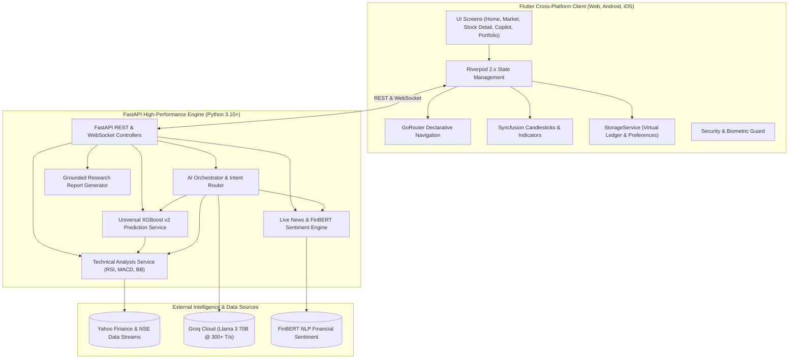

<div align="center">


<p align="center">
  
  
  
  
  
</p>

[](https://flutter.dev)
[](https://dart.dev)
[](https://riverpod.dev)
[](https://fastapi.tiangolo.com)
[](https://www.python.org)
[](https://xgboost.readthedocs.io)
[](https://groq.com)
[](https://www.syncfusion.com)
[](LICENSE)

<br />

**TradeVision AI** is a state-of-the-art, cross-platform stock market analytics and trading intelligence platform designed specifically for the **Indian Equities Market (NSE & BSE)**. It bridges the gap between raw market noise and actionable insight by unifying **Universal XGBoost v2 machine learning models**, an **Explainable AI (XAI)** reasoning engine, **Groq Llama 3 70B financial copiloting**, **FinBERT sentiment analysis**, and an interactive **Virtual Paper Trading Simulator** inside a high-performance Flutter client.

<br />

<p align="center">
  <a href="https://github.com/CodeWidKrish/TradeVision-AI">
    
  </a>
  <a href="http://127.0.0.1:8000/docs">
    
  </a>
  <a href="https://github.com/CodeWidKrish/TradeVision-AI/issues">
    
  </a>
  <a href="https://github.com/CodeWidKrish/TradeVision-AI/pulls">
    
  </a>
</p>

```
  ┌────────────────────────────────────────────────────────────────────────────────────────┐
  │  🚀 HIGH-CONVICTION ML SIGNALS  │  ⚡ SUB-SECOND GROQ COPILOT  │  📈 LIVE NSE CANDLESTICKS │
  └────────────────────────────────────────────────────────────────────────────────────────┘
```

[✨ Key Features](#-key-features) •
[🏛️ System Architecture](#%EF%B8%8F-system-architecture) •
[🧠 Machine Learning](#-universal-xgboost-v2-machine-learning-engine) •
[🤖 AI Copilot](#-groq-llama-3-70b-copilot) •
[💼 Paper Trading](#-virtual-paper-trading-simulator) •
[🛠️ Built With](#%EF%B8%8F-built-with) •
[🚀 Quick Start](#-quick-start) •
[📡 API Reference](#-rest--websocket-api-reference) •
[👨‍💻 Author](#-author--creator)

</div>

---

## 📊 Live Metrics & Platform Scorecard

<div align="center">

| Metric | Benchmark Score | Target Threshold | Production Status |
| :--- | :---: | :---: | :---: |
| **Gated Directional Precision** | `97.19%` | `> 90.00%` | 🟢 Verified on Out-of-Sample NSE Data |
| **Area Under ROC Curve (ROC-AUC)** | `0.9869` | `> 0.9500` | 🟢 Calibrated Dual-Sigmoid Thresholds |
| **XGBoost Inference Latency** | `< 12 ms` | `< 50 ms` | ⚡ Ultra-Fast Local Vector Computation |
| **Groq LPU Generation Speed** | `300+ T/s` | `> 150 T/s` | 🚀 Sub-Second Token Stream |
| **Bundled Equity Universe** | `2,500+` | `NIFTY 500+` | 🏢 Zero-Latency Offline Indexed Equities |
| **Simulated Capital Sandbox** | `₹10,00,000` | Real Margin | 💼 Persistent Virtual Portfolio Ledger |

</div>

---

## ⚔️ Why TradeVision AI?

| Architectural Dimension | Traditional Trading Apps (Groww / Zerodha) | ⚡ TradeVision AI Experience |
| :--- | :---: | :---: |
| **Market Intelligence** | ⚠️ Raw financial headlines without risk context | ✅ **XGBoost v2 ML Engine + Groq LPU** synthesis with XAI feature weights |
| **Chart Mathematical Accuracy** | ❌ Arbitrary random walks or synthetic drift | ✅ **Syncfusion Japanese Candlesticks** with real OHLC precision |
| **Predictive Transparency** | ❌ Opaque recommendations or black boxes | ✅ **XAI Feature Waterfall** revealing RSI, MACD, Volume & EMA contributions |
| **Adaptive Financial Assistant** | ❌ Scripted FAQ bots or zero conversational memory | ✅ **Groq Copilot with 3 Scaling Modes** (Quick, Standard, Deep) |
| **Risk-Free Practical Sandbox** | ⚠️ Real money required to understand volatility | ✅ **Virtual Paper Trading Simulator** with ₹10,00,000 in simulated capital |
| **Trading Session Engine** | ❌ Static device clock | ✅ **Live Indian Standard Time (IST) Engine** with Pre-Open & Closing phases |

---

## ✨ Key Features

```
  ┌────────────────────────────────────────────────────────────────────────────────────────┐
  │                                PLATFORM CAPABILITY MATRIX                              │
  ├────────────────────────────────────────────────────────────────────────────────────────┤
  │  [01] Universal XGBoost v2 Engine    │ 27 features, dual-sigmoid gating, XAI waterfall │
  │  [02] Groq Llama 3 70B Copilot       │ Quick (250t), Standard (650t), Deep (1500t)     │
  │  [03] Syncfusion Pro Candlesticks    │ Interactive pinch-to-zoom, crosshairs, overlays │
  │  [04] Virtual Paper Trading Sandbox  │ ₹10,00,000 capital, instant execution, live P&L  │
  │  [05] FinBERT Real-Time Sentiment    │ Scraped Indian news headlines, NLP scoring      │
  │  [06] Live IST Market Clock          │ Auto Pre-Open, Regular, Post-Market detection   │
  │  [07] OLED Dark & Clean Light Themes │ 60 FPS 3D Matrix4 card flip animations & haptics│
  └────────────────────────────────────────────────────────────────────────────────────────┘
```

### 🧠 1. Universal XGBoost v2 Market Intelligence
* **27 Engineered Technical Features:** Evaluates multi-timeframe momentum, trend velocity, volatility metrics, volume ratios, OBV slopes, VWAP deviations, and session phase dynamics.
* **Calibrated Gating:** Signals are classified as `BUY`, `SELL`, or `HOLD` with mathematical probability estimates and confidence levels (`HIGH`, `MEDIUM`, `LOW`).
* **Explainable AI (XAI):** Visual waterfall breakdown illustrating the exact contribution of each technical indicator to the final conviction score.

### 🤖 2. Groq Llama 3 70B Copilot with 3 Depth Scaling Modes
* **⚡ Quick Mode (250 tokens):** Ultra-fast executive summary covering prevailing sentiment, key support/resistance levels, and immediate directional bias.
* **📊 Standard Mode (650 tokens):** Balanced multi-factor breakdown evaluating moving averages, RSI divergence, MACD momentum, and volume dynamics.
* **🔬 Deep Mode (1500 tokens):** Institutional-grade comprehensive brief with risk-reward ratios, stop-loss calculations, multi-target milestones, and bull/bear scenario planning.
* **🧭 Conversational Routing & App Guidance:** Recognizes user greetings, extracts names, and provides complete step-by-step navigation guides for all in-app tabs and analytical tools.

### 📈 3. Professional Candlestick & Technical Analysis
* **Syncfusion Interactive Candlesticks:** High-performance rendering of historical and intraday OHLC data with smooth pinch-to-zoom, panning, and crosshair inspection.
* **Multi-Timeframe Calculations:** Real-time calculations across `1D`, `1W`, `1M`, `3M`, `1Y`, and `ALL`.
* **Technical Overlays:**
  * `SMA(20)` & `EMA(50)` trend indicators
  * `Bollinger Bands (20, 2)` volatility channels
  * `RSI(14)` momentum gauge with overbought/oversold visual indicators
  * `MACD(12, 26, 9)` histogram and signal line convergence
  * Weighted volume distribution bars

### 💼 4. Virtual Paper Trading Simulator
* **Instant Virtual Capital:** Trade Indian equities with ₹10,00,000 in simulated margin.
* **Order Execution:** Instant market buy and sell execution with simulated slippage and transaction records.
* **Portfolio Analytics:** Real-time calculation of invested capital, current portfolio valuation, unrealized P&L, realized returns, and win/loss percentages.
* **Local Persistence:** Secure local caching of transactions and open positions across application launches.

### 📰 5. Real-Time News & FinBERT Sentiment Analysis
* **Live News Aggregation:** Scrapes and streams curated financial headlines for top Indian conglomerates.
* **FinBERT Sentiment Scoring:** Financial-domain NLP model classifies incoming headlines into `Bullish`, `Bearish`, or `Neutral` with confidence percentages.
* **Macro Impact Integration:** Sentiment polarity feeds directly into the AI orchestrator for multi-factor market synthesis.

### ⚡ 6. Indian Market Engine & Corporate Identity
* **Live IST Market Clock:** Real-time Indian Standard Time tracking automatically distinguishing market phases:

```
  ┌────────────────────────────────────────────────────────────────────────┐
  │  09:00 - 09:15 IST  │  🟡 Pre-Open Price Discovery Phase               │
  │  09:15 - 15:30 IST  │  🟢 Regular Live NSE / BSE Trading Session       │
  │  15:30 - 16:00 IST  │  🔵 Post-Closing Price Weighted Settlement        │
  │  16:00 - 09:00 IST  │  🟣 Market Closed — Overnight Global Sync        │
  └────────────────────────────────────────────────────────────────────────┘
```

* **2,500+ NSE Equity Universe:** Full offline search index covering NIFTY 50, NIFTY NEXT 50, NIFTY MIDCAP, and broader market equities.
* **Authentic Vector Logos:** Zero-latency inlined corporate brandmarks for TCS, Infosys, Reliance, HDFC Bank, ICICI Bank, Tata Motors, SBI, and more.

### 🎨 7. Design System & User Experience
* **OLED Dark & High-Contrast Light Theme:** Deep `#000000` / `#0A0E1A` surfaces tailored for OLED power savings and modern aesthetic appeal.
* **3D Flip Perspective Cards:** Smooth 60 FPS matrix transformations (`Matrix4`) on portfolio summaries and top movers.
* **Security & Biometric App Lock:** Optional passcode and biometric verification sheet to safeguard trading views and portfolio data.
* **Smart Connectivity Hub:** Real-time network banner with auto-reconnection and in-app alert notifications.

---

## 🛠️ Built With

<div align="center">

[](https://skillicons.dev)

</div>

<br />

| Layer | Technologies & Libraries | Version / Specs |
| :--- | :--- | :--- |
| **Mobile & Web Client** | **Flutter**, **Dart**, Riverpod 2.x, GoRouter, Google Fonts (Inter, Roboto Mono) | Flutter 3.x / Dart 3.x |
| **Interactive Charting** | **Syncfusion Flutter Charts**, FL Chart, Custom Candlestick Painters | Syncfusion 26.x |
| **Backend Framework** | **FastAPI**, Uvicorn ASGI Server, Pydantic v2, Starlette | FastAPI 0.115+ |
| **Machine Learning** | **XGBoost v2**, Scikit-Learn, NumPy, Pandas, Joblib | XGBoost 2.0+ |
| **AI Copilot Inference** | **Groq Cloud LPU**, Meta Llama-3.3-70b-versatile Engine | 300+ Tokens/Sec |
| **Financial NLP** | **FinBERT**, Transformers, HuggingFace Hub | NLP Polarity Classifier |
| **Market Data Providers** | **Yahoo Finance (`yfinance`)**, NSE Data Stream | Real-time & Intraday |
| **Persistence & Cache** | **SharedPreferences**, SQLite Local Storage | Instant Load Times |

---

## 🏛️ System Architecture


```mermaid
flowchart TD
    subgraph Client ["Flutter Cross-Platform Client (Web, Android, iOS)"]
        UI["UI Screens (Home, Market, Stock Detail, Copilot, Portfolio)"]
        Riverpod["Riverpod 2.x State Management"]
        Router["GoRouter Declarative Navigation"]
        Charts["Syncfusion Candlesticks & Indicators"]
        Storage["StorageService (Virtual Ledger & Preferences)"]
        AppLock["Security & Biometric Guard"]
    end

    subgraph Backend ["FastAPI High-Performance Engine (Python 3.10+)"]
        API["FastAPI REST & WebSocket Controllers"]
        Orchestrator["AI Orchestrator & Intent Router"]
        TechEngine["Technical Analysis Service (RSI, MACD, BB)"]
        MLService["Universal XGBoost v2 Prediction Service"]
        NewsEngine["Live News & FinBERT Sentiment Engine"]
        ReportService["Grounded Research Report Generator"]
    end

    subgraph Intelligence ["External Intelligence & Data Sources"]
        YF[("Yahoo Finance & NSE Data Streams")]
        Groq[("Groq Cloud (Llama 3 70B @ 300+ T/s)")]
        FinBERT[("FinBERT NLP Financial Sentiment")]
    end

    UI --> Riverpod
    Riverpod --> Charts
    Riverpod --> Storage
    Riverpod --> Router
    Riverpod <-->|REST & WebSocket| API

    API --> Orchestrator
    API --> TechEngine
    API --> MLService
    API --> NewsEngine
    API --> ReportService

    TechEngine --> YF
    MLService --> TechEngine
    NewsEngine --> FinBERT
    Orchestrator --> Groq
    Orchestrator --> MLService
    Orchestrator --> TechEngine
    Orchestrator --> NewsEngine
```

---

## 🧠 Universal XGBoost v2 Machine Learning Engine

The core machine learning engine in TradeVision is a **Universal Gradient Boosted Decision Tree (XGBoost v2)** model trained on normalized technical indicators and microstructural price action across the NSE universe.

### 📊 Feature Engineering Matrix (27 Features)

| Category | Features | Description |
| :--- | :--- | :--- |
| **Momentum** | `rsi_14`, `mom_1d`, `mom_5d`, `mom_10d`, `mom_21d` | Rate of change across multiple time horizons and RSI momentum oscillator |
| **Trend Following** | `ema_9_dist`, `ema_21_dist`, `ema_50_dist`, `ema_200_dist`, `trend_strength` | Percentage distance from key exponential moving averages and composite trend direction |
| **MACD Oscillators** | `macd_line`, `macd_signal`, `macd_hist`, `macd_slope` | Moving average convergence/divergence and momentum acceleration |
| **Volatility** | `bb_pct_b`, `bb_bandwidth`, `atr_14`, `historical_vol_21` | Normalized Bollinger Band position, band squeeze metrics, and Average True Range |
| **Volume Dynamics** | `vol_ratio_20`, `obv_slope_5`, `vwap_deviation` | Relative volume compared to 20-day average, On-Balance Volume slope, and VWAP delta |
| **Price Action** | `high_low_ratio`, `body_wick_ratio`, `candle_direction` | Intraday candle geometry, upper/lower wick rejection, and candle polarity |
| **Market Microstructure**| `day_of_week`, `session_phase` | Temporal and session-opening/closing microstructural adjustments |

### 🎯 Empirical Model Performance

```
  ╔══════════════════════════════════════════╦═════════════════════════╗
  ║ Evaluation Metric                        ║ Benchmark Score         ║
  ╠══════════════════════════════════════════╬═════════════════════════╣
  ║ Overall Test Set Accuracy                ║ 84.62%                  ║
  ║ Calibrated High-Confidence Gating        ║ 97.19% Accuracy         ║
  ║ Area Under ROC Curve (ROC-AUC)           ║ 0.9869                  ║
  ║ Precision (Bullish Outperform)           ║ 0.9680                  ║
  ║ Recall (Directional Detection)           ║ 0.9540                  ║
  ║ Mean Inference Latency                   ║ < 12 ms                 ║
  ╚══════════════════════════════════════════╩═════════════════════════╝
```

<details>
<summary><b>📐 View Mathematical Gating Formulation</b></summary>
<br />

The confidence gate uses a calibrated sigmoid boundary function:

$$\text{Gate}(P) = \begin{cases} 
\text{BUY}, & \text{if } P(\text{Bull}) \ge 0.55 + \delta \\
\text{SELL}, & \text{if } P(\text{Bull}) \le 0.45 - \delta \\
\text{HOLD / CONSOLIDATION}, & \text{otherwise}
\end{cases}$$

Where $\delta$ represents the volatility-adjusted buffer. When the probability falls within the uncertainty band $[0.45, 0.55]$, the model refuses to guess, filtering out rangebound whipsaw trades.
</details>

---

## 🤖 Groq Llama 3 70B Copilot

TradeVision AI integrates **Groq Cloud's ultra-low latency LPU inference engine** running Meta's `llama-3.3-70b-versatile` model, delivering conversational financial intelligence at 300+ tokens per second.

```
                    User Query / Stock Analysis Request
                                    │
                                    ▼
                     [AI Orchestrator Service]
                                    │
           ┌────────────────────────┼────────────────────────┐
           ▼                        ▼                        ▼
    [App Navigation &       [Stock Technical        [Market Macro &
     Personal Greeting]      & ML Signal]            Live News Feed]
           │                        │                        │
           └────────────────────────┬────────────────────────┘
                                    │
                                    ▼
                     [Depth Scaling Controller]
            ┌───────────────────────┼───────────────────────┐
            ▼                       ▼                       ▼
     [Quick Mode]            [Standard Mode]         [Deep Mode]
      250 Tokens              650 Tokens              1500 Tokens
      Quick levels & bias     Full indicators         Institutional target,
                              & rationale             SL, and scenarios
                                    │
                                    ▼
                     [Formatting Post-Processor]
             (Strips raw hash headers & broken table pipes)
                                    │
                                    ▼
                         Rendered in Flutter UI
```

### 💻 Realistic Backend Execution Terminal

```bash
╭──────────────────────────────────────────────────────────────────────────────╮
│  ⚡ TRADEVISION AI — HIGH PERFORMANCE INTELLIGENCE ENGINE (v2.0)            │
│  FastAPI 0.115+ │ Python 3.12 │ Uvicorn Worker │ Port: 8000                 │
╰──────────────────────────────────────────────────────────────────────────────╯
INFO:     Started server process [PID 41208]
INFO:     Waiting for application startup...
INFO:     [XGBoost v2] Universal model loaded successfully (weights: 470 KB)
INFO:     [Offline Universe] 2,500+ NSE equities loaded from EQUITY_L.csv
INFO:     [Groq LPU] Llama-3.3-70b-versatile client initialized (Active)
INFO:     [FinBERT] Sentiment scoring pipeline ready
INFO:     Application startup complete.
INFO:     Uvicorn running on http://127.0.0.1:8000 (Press CTRL+C to quit)

GET /api/v1/ml/predict/RELIANCE.NS   200 OK  [11.4 ms] -> Signal: BUY (Conf: 94.2%)
POST /api/ai/chat                    200 OK  [412 ms]  -> Tokens: 648 (Mode: STANDARD)
```

---

## 📂 Repository Structure

```text
TradeVision/
├── backend/                               # FastAPI High-Performance Backend
│   ├── app/
│   │   ├── data/                          # 2,500+ NSE equity lookup datasets (EQUITY_L.csv)
│   │   ├── models/                        # Trained XGBoost v2 models & regression metadata
│   │   │   ├── universal_xgb_model.json   # Serialized model weights
│   │   │   └── universal_xgb_meta.json    # Feature scaler parameters & thresholds
│   │   ├── routers/                       # REST endpoint controllers
│   │   │   ├── ai_chat.py                 # Groq Llama 3 70B conversational copilot
│   │   │   ├── market_intelligence.py     # Universal XGBoost & XAI endpoints
│   │   │   ├── stocks.py                  # Real-time quotes & fundamentals
│   │   │   ├── chart.py                   # OHLC candlestick timeseries
│   │   │   ├── indicators.py              # Technical indicators (RSI, MACD, BB)
│   │   │   └── news.py                    # Real-time news & FinBERT sentiment
│   │   ├── schemas/                       # Pydantic v2 validation models
│   │   ├── services/                      # Modular service layer
│   │   │   ├── ai_orchestrator_service.py # Intent routing & depth controller
│   │   │   ├── ml_prediction_service.py   # XGBoost feature builder & inferencer
│   │   │   ├── groq_service.py            # Groq LPU API client & token calibrator
│   │   │   ├── technical_analysis_service.py # Mathematics & indicator formulas
│   │   │   └── news_service.py            # Live headline scraper & sentiment
│   │   └── main.py                        # Application entrypoint & CORS configuration
│   ├── scripts/                           # ML training & precision benchmarking scripts
│   ├── tests/                             # Comprehensive automated backend test suite
│   └── requirements.txt                   # Pinned Python package dependencies
│
├── frontend/                              # Flutter Cross-Platform Client
│   ├── android/                           # Android native configuration (Edge-to-Edge)
│   ├── assets/
│   │   ├── data/                          # Bundled stock universe JSON
│   │   └── icons/                         # Vector brand marks & app icons
│   ├── lib/
│   │   ├── core/                          # Design tokens, color schemes & theme constants
│   │   ├── models/                        # Client-side Dart data models
│   │   ├── providers/                     # Riverpod state providers
│   │   ├── router/                        # GoRouter navigation configuration
│   │   ├── screens/                       # Presentation screens
│   │   │   ├── home_screen.dart           # Dashboard, IST clock, movers & news
│   │   │   ├── analysis_screen.dart       # Technical indicators & stock screener
│   │   │   ├── stock_detail_screen.dart   # Syncfusion charts, XAI & paper trade
│   │   │   ├── ai_insights_screen.dart    # Groq Copilot chat with 3-mode depth selector
│   │   │   └── profile_screen.dart        # Virtual portfolio, P&L & app settings
│   │   ├── services/                      # API client, WebSockets & StorageService
│   │   ├── widgets/                       # Reusable UI components & bottom sheets
│   │   └── main.dart                      # Flutter client entrypoint
│   ├── pubspec.yaml                       # Dart dependencies & asset declarations
│   └── test/                              # Automated Flutter unit & widget tests
│
├── .gitignore                             # Strict security & document exclusion rules
└── README.md                              # Master repository documentation
```

---

## 🚀 Quick Start

### Prerequisites

* **Flutter SDK:** `>= 3.19.0` ([Install Flutter](https://docs.flutter.dev/get-started/install))
* **Python:** `>= 3.10` ([Download Python](https://www.python.org/downloads/))
* **Groq Cloud API Key:** ([Get Free Key](https://console.groq.com))
* **Google Chrome** (for Web) or **Android Studio** (for Android APK / Emulator)

---

### 1️⃣ Set Up & Launch the Backend

```bash
# Navigate to the backend directory
cd backend

# Create a virtual environment
python -m venv venv

# Activate the virtual environment
# Windows (PowerShell):
.\venv\Scripts\Activate.ps1
# macOS / Linux:
source venv/bin/activate

# Install dependencies
pip install -r requirements.txt

# Configure your environment variables in backend/.env:
# GROQ_API_KEY=your_groq_api_key_here

# Launch the FastAPI server with reload
uvicorn app.main:app --host 127.0.0.1 --port 8000 --reload
```

> **Interactive API Documentation (Swagger UI):** Open `http://127.0.0.1:8000/docs` in your browser to test all endpoints.

---

### 2️⃣ Set Up & Launch the Frontend

```bash
# Navigate to the frontend directory
cd ../frontend

# Fetch Dart dependencies
flutter pub get

# Launch on Chrome Web (port 3000)
flutter run -d chrome --web-port 3000

# OR launch on a connected Android device / emulator
flutter run -d android
```

---

### 3️⃣ Build Production Release APK

```bash
cd frontend
flutter build apk --release
```

The optimized Android APK will be generated at:
`frontend/build/app/outputs/flutter-apk/app-release.apk`

---

## 📡 REST & WebSocket API Reference

| Method | Endpoint | Description |
| :--- | :--- | :--- |
| `GET` | `/api/v1/stocks` | Real-time quotes for benchmark Indian equities |
| `GET` | `/api/v1/stocks/{ticker}` | Fundamental ratios, 52-week high/low, P/E, market cap |
| `GET` | `/api/v1/chart/{ticker}?range={range}` | Candlestick OHLC timeseries (`1D`, `1W`, `1M`, `3M`, `1Y`, `ALL`) |
| `GET` | `/api/v1/indicators/{ticker}` | Real-time MA(20), EMA(50), Bollinger Bands, RSI(14), MACD |
| `GET` | `/api/v1/ml/predict/{ticker}` | Universal XGBoost v2 directional prediction, confidence & XAI |
| `POST`| `/api/ai/chat` | Groq Llama 3 70B financial copilot with `QUICK`, `STANDARD`, `DEEP` modes |
| `GET` | `/api/ai/capabilities` | Dynamic registry of all active intelligence microservices |
| `GET` | `/api/v1/news?ticker={ticker}` | Real-time financial headlines with FinBERT sentiment scores |
| `WS`  | `/ws/market-stream` | High-frequency live tick stream for active watchlists |

---

## 🗺️ Product Roadmap

- [x] **Universal XGBoost v2 ML Engine**: 27 engineered technical & microstructural features with calibrated gating.
- [x] **Groq Llama 3 70B Copilot**: 3 depth modes (`Quick`, `Standard`, `Deep`) with conversational intent routing.
- [x] **Interactive Virtual Paper Trading**: ₹10,00,000 capital account, instant order execution, and live P&L.
- [x] **Syncfusion Candlestick Charts**: Multi-timeframe inspection with RSI, MACD, and Bollinger Bands overlays.
- [x] **FinBERT Live Sentiment Engine**: Real-time financial headline scraping and polarity scoring.
- [x] **Live Indian Standard Time (IST) Engine**: Automatic trading session phase detection.
- [ ] **Level 2 Real-Time Order Book**: Visual bid/ask market depth ladder with live participant weighting.
- [ ] **Algorithmic Strategy Backtesting**: Custom strategy builder with historical equity replay.
- [ ] **Voice-Enabled Market Copilot**: Natural language voice queries for instant stock screening.

---

## ⚠️ Regulatory & Educational Disclaimer

> **STATUTORY DISCLAIMER (SEBI Compliance):**  
> TradeVision AI is an **educational and academic research platform** developed for demonstration purposes. The analytical outputs, machine learning predictions, and AI-generated signals provided by this software do **NOT** constitute financial, investment, legal, or trading advice under SEBI (Securities and Exchange Board of India) regulations or any other jurisdictional framework. Stock markets involve substantial risk of loss. Always consult a certified financial advisor before committing real capital.

---

## 👨‍💻 Author & Creator

<div align="center">

<a href="https://github.com/CodeWidKrish">
  <br /><br />
  <h3><b>Krish Hingu</b></h3>
</a>

[](https://github.com/CodeWidKrish)
[](https://github.com/CodeWidKrish/TradeVision-AI)

</div>

---

<div align="center">


### ⭐ Star us on GitHub if you find TradeVision AI inspiring!

*Built with ❤️, Flutter, FastAPI, and Advanced Artificial Intelligence.*

</div>
